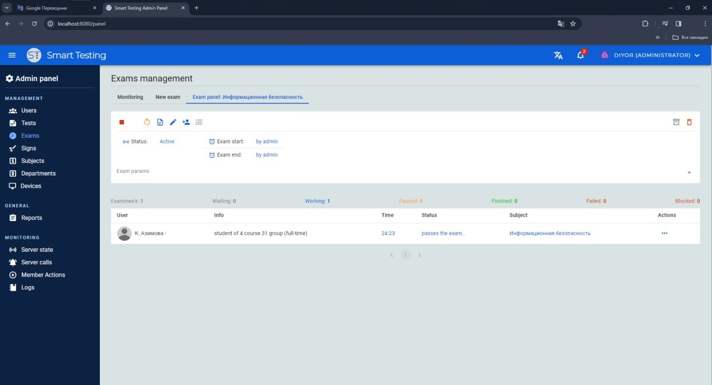

# st-admin-client

### Стек технологий
<div>
    
    
    
</div>

###
> Проект провальный. Рабочий, но очень плохо написанный. <strong>Идёт работа над над ST v.1.2</strong>

### Информация
<strong>st-admin-client</strong> - один из модулей системы SmartTesting. Клиент представляет собой админ панель, где можно управлять всеми данными системы SmartTesting.

Особенно важным состовлющим админ панели является мониторинг экзаменов

<div align="center">
    
</div>

### Сборка и запуск
- устанавливаем зависимости:
```bash
npm i
```

- собираем клиент:
```bash
npm run build
```

- запустить клиент в режиме разработки:
```bash
npm run serve
```